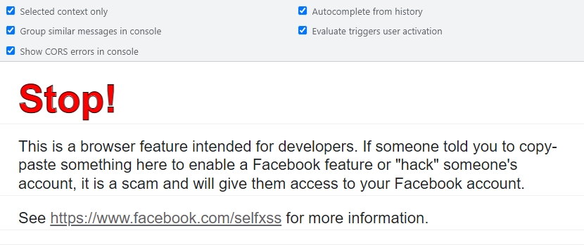
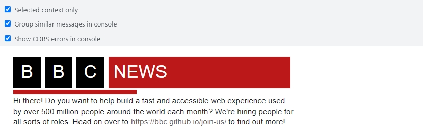

# @morev/console.css

The library to style browser console messages.


[](https://opensource.org/licenses/MIT)


## Why?

`¯\_(ツ)_/¯`

Sometimes you may want to warn users of your site like Facebook does:



Perhaps you want to make a prominent message to the developers like BBC does:



Maybe you want to enchance some of your custom dev utilities, etc.

**BUT**

If you want to print BBC News logotype in the console, you need to write smth like that:
```js
console.log('%cB%c %cB%c %cB%c %cNEWS       %c', 'font-style:bold;font-size:40px;padding:4px 16px;background:#000;color:#fff;', 'background:none', 'font-style:bold;font-size:40px;padding:4px 16px;background:#000;color:#fff;', 'background:none', 'font-style:bold;font-size:40px;padding:4px 16px;background:#000;color:#fff;', 'background:none', 'font-style:bold;font-size:40px;padding:4px 16px;background:#b80000;color:#fff;', 'background:none');
```

Copy-paste into you browser console and press `Enter` to see the result. \
The code doesn't look friendly, huh?

**But there is another way:**

```js
import ConsoleCSS from '@morev/console.css';

ConsoleCSS.add(`
  .letter {
    font-style: bold;
    font-size: 40px;
    padding: 4px 16px;
    background: #000000;
    color: #ffffff;
  }
  .bg-red {
    background: #ff0000;
  }
`);

ConsoleCSS.styled.log(`
  <span class="letter">B</span>
  <span class="letter">B</span>
  <span class="letter">C</span>
  <span class="letter bg-red">News</span>
`)
```
---

## Installation

### Using `yarn`

```bash
yarn add @morev/console.css
```

### Using `npm`

```bash
npm install @morev/console.css
```

### Using `pnpm`

```bash
pnpm add @morev/console.css
```

## Usage

The package exports the ConsoleCSS class instance that considered singleton. \
If used directly in HTML without any bundler - it's available via `window.ConsoleCSS`.

> **Important:** The package only works in browser. It doesn't fall but does nothing on server side.

### Default styles

By default, the package styles only well-known HTML tags:
* `<b>` - **bold** text
* `<i>` - *italic* text
* `<u>` - _underlined_ text
* `<s>` - ~~strikethrough~~ text

### Inline style

You may use inline styles:

```js
import ConsoleCSS from '@morev/console.css';

ConsoleCSS.styled.log(`<b style="color: red;">Red bold text</b>`);
```

### Adding custom CSS tokens

The core class has a method `.add(rules: string)` that accepts a CSS-like string with needed tokens. \
You can use `.add()` method multiple times.

> This input string isn't validated, so make sure your CSS syntax is correct.

```ts
import ConsoleCSS from '@morev/console.css';

ConsoleCSS.add(`
  .block { color: red; text-decoration: underline; }
`);

ConsoleCSS.styled.log('<span class="block">Red underlined text</span>');
```

### Override the default `window.console` object

That might be annoying to remember about custom styled messages class, so the library provides a way to replace global `window.console`

```ts
import ConsoleCSS from '@morev/console.css';

// No matters before or after `.override()` call
ConsoleCSS.add(`
  .block { color: red; text-decoration: underline; }
`);

ConsoleCSS.override();

console.log('Wow, <span class="block">a styled message</span> using native `console.log`!');

// Restore the original `window.console`
ConsoleCSS.restore();

console.log('No longer <span class="block">styled</span> messages :(');
```
